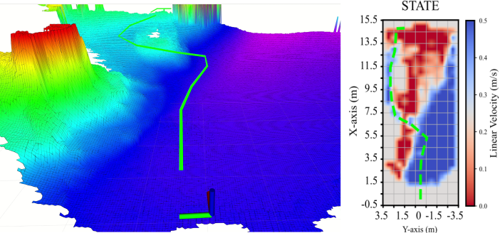

# STATE-NAV: Stability-Aware Traversability Estimation for Bipedal Navigation on Rough Terrain
It is under active development! We will soon come up with ROS2 version. + We are actively working on adding more features.
## Overview


**STATE-NAV** is the first learning-based traversability estimation and navigation framework for humanoids on diverse rough terrain. It learns a stability-aware velocity-based traversability representation of terrain by carefully selecting a self-supervised locomotion signal for bipedal locomotion and integrates this knowledge into a hierarchical planning framework for safe and efficient navigation.


### Practical sub-module use cases
- **Get TravRRT for Terrain Navigation**: A computationally efficient RRT* for terrain navigation with traversability. Theoretically, RRT* assumes Lipschitz-continuous costs, which break on rough terrain where traversability changes abruptly, and forcing large rewiring radius. TravRRT* avoids this by biased sampling toward high-traversability regions—much like how humans just ignore infeasible paths (you don’t even think about walking through a bush, do you?). (Why not A*? yaw angle makes the search 3D! High computation. And also, heuristics for computing h(x).)
  
- **Get Bipedal Traversability for Humanoids**: An off-the-shelf bipedal traversability map—insert an elevation map, receive a traversability map.


### Why STATE-NAV?

- **Carefully selected self-supervising signal for bipedal locomotion**: The first learning-based traversability estimation framework for bipedal locomotion. Uses Body-to-Stance-Foot Angle (BFSA), which has high correlation with bipedal fallover, as a traversability label for self-supervision. Unlike previous approaches that rely on traction or IMU signals (used for quadrupeds but not validated for bipedal instability), BFSA provides a more appropriate signal for bipedal locomotion.

- **Velocity-based traversability: Robot-specific (environment-agnostic) cost formulation**: Represents traversability not as a unitless cost or score, but as velocity with physical meaning. Defines the fastest velocity that a robot can traverse while maintaining instability (a robot-specific parameter) risk-sensitively within acceptable limits. This velocity representation replaces traditional path planning costs of $c_{ij} = \sum_{k \in M} (1 + w(1/t_k))^p \Delta l_k$ which depends on environment-specific hyperparameter $w$ that requires retuning for every environment.

- **Safe learning-planning integration**: Rather than end-to-end learning, leverages the learned model where it can do what models cannot and integrates the learned representation effectively within a hierarchical planning strategy—as a cost term in RRT* path planning and as a constraint in MPC local planning.

- **Modular and extensible**: Provides researchers with traversability maps and path plans for bipedal locomotion trained with Digit. Support for other robots will be added in future releases.


### Key Features

- **Traversability Estimation**: TravFormer, a transformer-based neural network, predicts bipedal instability along with its uncertainty.
Traversability is defined as a stability-aware command velocity: the fastest command that keeps predicted instability within a user-specified limit.
The model supports risk-aware planning via Value at Risk (VaR) and operates directly from elevation maps.

- **TravRRT Global Planning**: A global planner that leverages the predicted stability-aware velocity to generate time-efficient and risk-sensitive paths.
Consistently avoids unsafe terrain without manual weight tuning or environment-specific adjustments.


## Citing
If you use STATE-NAV in your research, please cite:

```bibtex
@ARTICLE{11316382,
  author={Yoon, Ziwon and Zhu, Lawrence Y. and Lu, Jingxi and Gan, Lu and Zhao, Ye},
  journal={IEEE Robotics and Automation Letters}, 
  title={STATE-NAV: Stability-Aware Traversability Estimation for Bipedal Navigation on Rough Terrain}, 
  year={2025},
  volume={},
  number={},
  pages={1-8},
  keywords={Navigation;Planning;Robots;Estimation;Humanoid robots;Uncertainty;Stability criteria;Legged locomotion;Costs;Training;Humanoids;legged robots;traversability;navigation;planning;model predictive control;stability},
  doi={10.1109/LRA.2025.3648502}}
```


## Quick instructions to run

ROS2 version will be supported soon.

### Cloning Repositories

Clone the repo:

```zsh
cd $(path_to_your_catkin_workspace)/src
git clone 
```

### Easy: Prebuilt Docker Image ###
The easiest way is downloading a prebuilt container from `docker.io/twoleggedcoffeedrinker/state_nav:latest`.
If it is not available, you can choose to build the docker image from scratch as following:

### If not: Manually building Docker container ###

#### Preliminaries
First, Install Docker: https://docs.docker.com/desktop/install/ubuntu/

Second, install nvidia container toolkit: https://docs.nvidia.com/datacenter/cloud-native/container-toolkit/latest/install-guide.html


#### Building an Image

```zsh
cd $(path_to_your_catkin_workspace)/src/state_nav/docker
docker build -f Dockerfile.x64 -t biped_nav_sim .
# You might need to change the image name in `runfrombuild.sh`
```

#### Opening a container

After building, open a container.

**********Caution***********
Make sure to change the line 3 in your `runfrombuild.sh` for path to your home directory and catkin ws.
* When reopening container throws an error for XAUTH, delete your /tmp/.X11-unix and /tmp/.docker.xauth and then running ./runfrombuild would work. Running ./runfrombuild with sudo might potentially cause a problem for setting home directory.

```zsh
sudo rm -rf /tmp/.X11-unix
sudo rm -rf /tmp/.docker.xauth
```

```zsh
./runfrombuild.sh
```

#### Opening shells and running the Startup script
After opening an container, open an interactive shell in the container.

Run the following. You should be in the container's filesystem.
```zsh
. $HOST_HOME_DIR/$(path_to_your_catkin_workspace)/src/state_nav/docker/startup.sh
```

This will build ROS package. Now you are good to go.
Keep in mind that what happend in `startup.sh` is only valid in this specific container. If you open a new container, you have to do the same thing again.
Also, when you do ROS build in a docker container, it might conflict if you do ROS build outside of the container. 


## Running


Run the followings in separate shells.

(0-1) `rosbag play $(path_to_your_catkin_workspace)/src/state_nav/ROS/1017_2.bag`

    # Plays back recorded sensor data (camera pointcloud, elevation map, path plan, etc.) from a rosbag file.
    # It is recording of one of our outdoor experiments.
    # Replace $(path_to_your_catkin_workspace) with your actual catkin workspace path.

(0-2) `rosrun rviz rviz -d $(path_to_your_catkin_workspace)/src/state_nav/ROS/rviz_setting.rviz`

    # Launches RViz visualization tool with a pre-configured setup to visualize
    # the traversability maps, planned paths, robot pose, and other ROS topics.
    # Replace $(path_to_your_catkin_workspace) with your actual catkin workspace path.

(1) Modify `executables/configs/planning_config.yaml` as you want. 

(2) Run `rosrun state_nav main_traversability_estimation.py` for traversability estimation.

    # Launches the traversability estimation node that converts elevation map to traversability map.
    # Computes stability-aware traversability maps using the TravFormer neural network.
    # This node publishes costmaps that indicate safe navigation regions for the bipedal robot.

(3) `rosrun state_nav main_global_planning.py` if you want TravRRT* to do planning. This is optional if you don't need a path plan.

    # Launches the global path planning node that uses TravRRT* to compute optimal paths
    # based on the traversability maps. This node subscribes to costmaps and robot pose,
    # then publishes planned paths for navigation.


## Acknowledgments

This project builds upon the following open-source works:

### Docker and RViz Configuration
The Docker setup and RViz visualization configurations are adapted from [elevation_mapping_cupy](https://github.com/leggedrobotics/elevation_mapping_cupy) ([MIT License](https://github.com/leggedrobotics/elevation_mapping_cupy/blob/main/LICENSE)).

### RRT* Path Planning
The RRT* (Rapidly-exploring Random Tree Star) implementation is based on [pypolo](https://github.com/Weizhe-Chen/pypolo) ([MIT License](https://github.com/Weizhe-Chen/pypolo/blob/main/LICENSE)), a Python library for Robotic Information Gathering.

We gratefully acknowledge the contributions of these projects to the robotics community.
