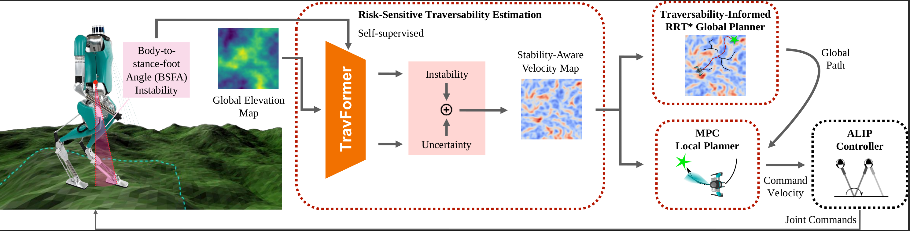

# STATE-NAV: STATE-NAV: Stability-Aware Traversability Estimation for Bipedal Navigation on Rough Terrain

## Overview


**STATE-NAV** is a learning-based traversability estimation and risk-sensitive velocity-based navigation framework for bipedal robots operating in diverse and uneven environments. It learns a stability-aware representation of terrain by carefully selecting a self-supervised locomotion signal and integrates this knowledge into a hierarchical planning framework for safe and efficient navigation.

### Why STATE-NAV?

- **Avoids brittle terrain heuristics**: No reliance on hand-tuned cost functions that break in new environments
- **Robot-specific and environment-agnostic**: Provides a generalizable way to measure traversability tailored to bipedal locomotion
- **Safe learning-planning integration**: Offers a clean abstraction that integrates learning and planning without sacrificing safety
- **Modular and extensible**: Allows researchers to plug in other instability metrics, controllers, or planners


### Key Features

- **Traversability Estimation**: TravFormer, a transformer-based neural network, predicts bipedal instability along with its uncertainty.
Traversability is defined as a stability-aware command velocity: the fastest command that keeps predicted instability within a user-specified limit.
The model supports risk-aware planning via Value at Risk (VaR) and operates directly from elevation maps.

- **TravRRT Global Planning**: A global planner that leverages the predicted stability-aware velocity to generate time-efficient and risk-sensitive paths.
Consistently avoids unsafe terrain without manual weight tuning or environment-specific adjustments.


## Citing
If you use STATE-NAV in your research, please cite:

```bibtex
@article{yoon2025state,
  title={STATE-NAV: Stability-Aware Traversability Estimation for Bipedal Navigation on Rough Terrain},
  author={Yoon, Ziwon and Zhu, Lawrence Y and Gan, Lu and Zhao, Ye},
  journal={arXiv preprint arXiv:2506.01046},
  year={2025}
}
```


## Quick instructions to run

### Cloning Repositories

Clone the repo:

```zsh
cd $(path_to_your_catkin_workspace)/src
git clone 
```


### Docker and NVIDIA environment Installation
First, Install Docker: https://docs.docker.com/desktop/install/ubuntu/
Second, install nvidia container toolkit: https://docs.nvidia.com/datacenter/cloud-native/container-toolkit/latest/install-guide.html


### Building Docker Image
An easy way is to download prebuilt container from `docker.io/twoleggedcoffeedrinker/state_nav:latest`.

Or, you can build by your own from scratch.

```zsh
cd $(path_to_your_catkin_workspace)/src/state_nav/docker
docker build -f Dockerfile.x64 -t biped_nav_sim .
# You might need to change the image name in `runfrombuild.sh`
```

### Opening a container

After building, open a container.

**********Caution***********
Make sure to change the line 3 in your `runfrombuild.sh` for path to your home directory and catkin ws.
* When reopening container throws an error for XAUTH, delete your /tmp/.X11-unix and /tmp/.docker.xauth and then running ./runfrombuild would work. Running ./runfrombuild with sudo might potentially cause a problem for setting home directory.

```zsh
sudo rm -rf /tmp/.X11-unix
sudo rm -rf /tmp/.docker.xauth
```

```zsh
./runfrombuild.sh
```

### Opening shells and running the Startup script
After opening an container, open an interactive shell in the container.


Run the following. You should be in the container's filesystem.
```zsh
. $HOST_HOME_DIR/$(path_to_your_catkin_workspace)/src/state_nav/docker/startup.sh
```

This will build ROS package. Now you are good to go.
Keep in mind that this build is only valid in this specific container. If you open a new container, you have to do the same thing again.
Also, when you do ROS build in a docker container, it might conflict if you do ROS build outside of the container. 


## Running


Run the followings in separate shells.

(1) Modify `executables/configs/planning_config.yaml`.


(2) `rosrun state_nav main_traversability_estimation.py`

    # Launches the traversability estimation node that converts elevation map to traversability map.
    # Computes stability-aware traversability maps using the TravFormer neural network.
    # This node publishes costmaps that indicate safe navigation regions for the bipedal robot.

(3) `rosrun state_nav main_global_planning.py`

    # Launches the global path planning node that uses TravRRT* to compute optimal paths
    # based on the traversability maps. This node subscribes to costmaps and robot pose,
    # then publishes planned paths for navigation.

(4) `rosbag play $(path_to_your_catkin_workspace)/src/state_nav/ROS/1017_2.bag`

    # Plays back recorded sensor data (camera pointcloud, elevation map, path plan, etc.) from a rosbag file.
    # It is recording of one of our outdoor experiments.
    # Replace $(path_to_your_catkin_workspace) with your actual catkin workspace path.

(5) `rosrun rviz rviz -d $(path_to_your_catkin_workspace)/src/state_nav/ROS/rviz_setting.rviz`

    # Launches RViz visualization tool with a pre-configured setup to visualize
    # the traversability maps, planned paths, robot pose, and other ROS topics.
    # Replace $(path_to_your_catkin_workspace) with your actual catkin workspace path.

## Acknowledgments

This project builds upon the following open-source works:

### Docker and RViz Configuration
The Docker setup and RViz visualization configurations are adapted from [elevation_mapping_cupy](https://github.com/leggedrobotics/elevation_mapping_cupy) ([MIT License](https://github.com/leggedrobotics/elevation_mapping_cupy/blob/main/LICENSE)).

### RRT* Path Planning
The RRT* (Rapidly-exploring Random Tree Star) implementation is based on [pypolo](https://github.com/Weizhe-Chen/pypolo) ([MIT License](https://github.com/Weizhe-Chen/pypolo/blob/main/LICENSE)), a Python library for Robotic Information Gathering.

We gratefully acknowledge the contributions of these projects to the robotics community.
