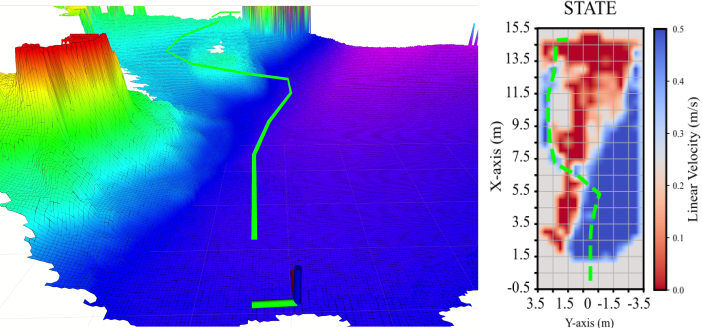
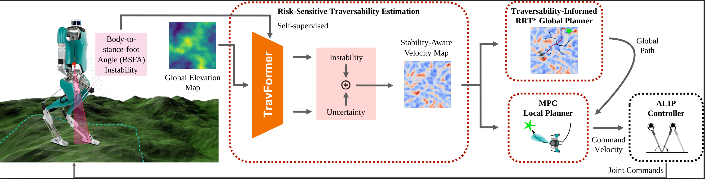

# STATE-NAV: Stability-Aware Traversability Estimation for Bipedal Navigation on Rough Terrain

## Update News!
Now working on adding A* (path would be discrete but is faster than RRT* by 100x for the attached ROSbag env) and integrating STATE-NAV's bipedal traversability with VLN - VAMOS (https://vamos-vla.github.io/)

[Jul 04 2026] ROS2 version with Docker setting, ROS2 bag, etc. available! 
Also major updates and refactoring in code: now ~10x faster running.
Checkpoint for Unitree G1's blind locomotion controller released.

## Overview


**STATE-NAV** is the first learning-based traversability estimation and navigation framework for humanoids on diverse rough terrain. It learns a stability-aware velocity-based traversability representation of terrain by carefully selecting a self-supervised locomotion signal for bipedal locomotion and integrates this knowledge into a hierarchical planning framework for safe and efficient navigation.



### Practical sub-module use cases
- **Get TravRRT for Terrain Navigation**: A computationally efficient RRT* for terrain navigation with traversability. Theoretically, RRT* assumes Lipschitz-continuous costs, which break on rough terrain where traversability changes abruptly, and forcing large rewiring radius. TravRRT* avoids this by biased sampling toward high-traversability regions—much like how humans just ignore infeasible paths (you don’t even think about walking through a bush, do you?). (Why not A*? yaw angle makes the search 3D! High computation. And also, heuristics for computing h(x).)
  
- **Get Bipedal Traversability for Humanoids**: An off-the-shelf bipedal traversability map—insert an elevation map, receive a traversability map.


### Why STATE-NAV?

- **Carefully selected self-supervising signal for bipedal locomotion**: The first learning-based traversability estimation framework for bipedal locomotion. Uses Body-to-Stance-Foot Angle (BFSA), which has high correlation with bipedal fallover, as a traversability label for self-supervision. Unlike previous approaches that rely on traction or IMU signals (used for quadrupeds but not validated for bipedal instability), BFSA provides a more appropriate signal for bipedal locomotion.

- **Velocity-based traversability: Robot-specific (environment-agnostic) cost formulation**: Represents traversability not as a unitless cost or score, but as velocity with physical meaning. Defines the fastest velocity that a robot can traverse while maintaining instability (a robot-specific parameter) risk-sensitively within acceptable limits. This velocity representation replaces traditional path planning costs of $c_{ij} = \sum_{k \in M} (1 + w(1/t_k))^p \Delta l_k$ which depends on environment-specific hyperparameter $w$ that requires retuning for every environment.

- **Safe learning-planning integration**: Rather than end-to-end learning, leverages the learned model where it can do what models cannot and integrates the learned representation effectively within a hierarchical planning strategy—as a cost term in RRT* path planning and as a constraint in MPC local planning.

- **Modular and extensible**: Provides researchers with traversability maps and path plans for bipedal locomotion trained with Digit. Support for other robots will be added in future releases.


### Key Features

- **Traversability Estimation**: TravFormer, a transformer-based neural network, predicts bipedal instability along with its uncertainty.
Traversability is defined as a stability-aware command velocity: the fastest command that keeps predicted instability within a user-specified limit.
The model supports risk-aware planning via Value at Risk (VaR) and operates directly from elevation maps.

- **TravRRT Global Planning**: A global planner that leverages the predicted stability-aware velocity to generate time-efficient and risk-sensitive paths.
Consistently avoids unsafe terrain without manual weight tuning or environment-specific adjustments.


## Citing
If you use STATE-NAV in your research, please cite:

```bibtex
@article{yoon2025state,
  title={STATE-NAV: Stability-Aware Traversability Estimation for Bipedal Navigation on Rough Terrain},
  author={Yoon, Ziwon and Zhu, Lawrence Y and Lu, Jingxi and Gan, Lu and Zhao, Ye},
  journal={IEEE Robotics and Automation Letters},
  volume={11},
  number={2},
  pages={2338--2345},
  year={2025},
  publisher={IEEE}
}
```


## Quick instructions to run

### • Cloning Repositories

First, create and navigate into your ROS2 workspace source directory. This ensures the repository is placed in the correct workspace structure.

Second, clone the repo.

```zsh
# Go to your ROS workspace (replace with your actual path)
cd $(path_to_your_ros2_workspace)

# Create the workspace folder structure
mkdir -p statenav_ws/src

# Move into the src directory
cd statenav_ws/src

# Clone STATE-NAV into a folder named state_nav
git clone https://github.com/yzwfromk/STATE-NAV.git state_nav

# Enter the repository
cd state_nav

# Ensure you are on the ROS2 branch
git checkout ROS2
```

### Docker and NVIDIA environment Installation

First, Install Docker: [https://docs.docker.com/desktop/install/ubuntu/](https://docs.docker.com/desktop/install/ubuntu/)
Second, install nvidia container toolkit: [https://docs.nvidia.com/datacenter/cloud-native/container-toolkit/latest/install-guide.html](https://docs.nvidia.com/datacenter/cloud-native/container-toolkit/latest/install-guide.html)

### •  Building Docker Image

```zsh
cd $(path_to_your_ros2_workspace)/statenav_ws/src/state_nav
docker build -f docker/Dockerfile.x64 -t biped_nav_sim .
# You might need to change the image name in `runfrombuild.sh`
```

### • Opening a container

After building, open a container.

- When reopening container throws an error for XAUTH, delete your /tmp/.X11-unix and /tmp/.docker.xauth and then running ./runfrombuild would work. Running ./runfrombuild with sudo might potentially cause a problem for setting home directory.

```zsh
sudo rm -rf /tmp/.X11-unix
sudo rm -rf /tmp/.docker.xauth
```

```zsh
cd $(path_to_your_ros2_workspace)/statenav_ws/src/state_nav/docker
./runfrombuild.sh
```

### • Running the Startup script

After opening an container, run the startup script.

⚠️ Before running the script, update `docker/startup.sh` by setting `STATENAV_SRC` to the path where you cloned this repository.

```zsh
# Default path for Statenav source directory
STATENAV_SRC="${STATENAV_SRC:-${HOST_HOME_DIR}/Desktop/ros2_ws/statenav_ws/src/state_nav}"
```
Run the following. 

```zsh
. $HOST_HOME_DIR/$(path_to_your_ros2_workspace)/statenav_ws/src/state_nav/docker/startup.sh
```

This will build the ROS 2 packages and set up the environment. Now you are good to go.
Keep in mind that this build is only valid in this specific container. If you open a new container, you have to do the same thing again.
Also, when you do ROS2 build in a docker container, it might conflict if you do ROS2 build outside of the container.

### • Sourcing

After successfully running startup.sh, source the ROS 2 workspace in **every new terminal** before running any nodes.

```bash
source $HOST_HOME_DIR/$(path_to_your_ros2_workspace)/statenav_ws/install/setup.bash
```


### Step 1 — Set your goal and map settings

Edit `statenav_global/configs/planning_config.yaml`.

Most users only need to change `global_goal` (where to go) and `initial_start` (where to start).
The configuration file allows users to change various parameters related to traversability mapping.

### Step 2 — Build the safe-terrain map (first terminal)

```bash
ros2 run statenav_global traversability_estimation
```


```bash
# Launches the traversability estimation node that converts elevation map to traversability map.
# Computes stability-aware traversability maps using the TravFormer neural network.
# This node publishes costmaps that indicate safe navigation regions for the bipedal robot.
```

### Step 3 — Plan a path (second terminal)

```bash
ros2 run statenav_global global_planning
```

```bash
# Launches the global path planning node that uses TravRRT* to compute optimal paths
# based on the traversability maps. This node subscribes to costmaps and robot pose,
# then publishes planned paths for navigation.
```

### Step 4 — Play recorded data (third terminal)

```bash
ros2 bag play $(path_to_your_ros2_workspace)/statenav_ws/src/state_nav/ROS/bag_isaac
```

```bash
# Plays back recorded sensor data (camera pointcloud, elevation map, path plan, etc.) from a rosbag file.
# The above command will replay a sample recording from one of our outdoor experiments.
# Replace $(path_to_your_ros2_workspace) with your actual ROS2 workspace path.
```

### Step 5 — Visualize in RViz (fourth terminal)

```bash
rviz2 -d $(path_to_your_ros2_workspace)/statenav_ws/src/state_nav/ROS/rviz_setting.rviz
```

```bash
# The above command will launches RViz2 visualization tool with a pre-configured setup to visualize
# the traversability maps, planned paths, robot pose, and other ROS2 topics.
# Replace $(path_to_your_ros2_workspace) with your actual ROS2 workspace path.
```

### Quick reference


| Step | Command                     | What you get              |
| ---- | --------------------------- | ------------------------- |
| 1    | Edit `planning_config.yaml` | Start, goal, and settings |
| 2    | `traversability_estimation` | Safe-terrain map          |
| 3    | `global_planning`           | Path to goal planning     |
| 4    | `ros2 bag play ...`         | Demo replay               |
| 5    | `rviz2 -d ...`              | Visualization             |

## Acknowledgments

This project builds upon the following open-source works:

### Docker and RViz Configuration

The Docker setup and RViz visualization configurations are adapted from [elevation_mapping_cupy](https://github.com/leggedrobotics/elevation_mapping_cupy) ([MIT License](https://github.com/leggedrobotics/elevation_mapping_cupy/blob/main/LICENSE)).

### RRT* Path Planning

The RRT* (Rapidly-exploring Random Tree Star) implementation is based on [pypolo](https://github.com/Weizhe-Chen/pypolo) ([MIT License](https://github.com/Weizhe-Chen/pypolo/blob/main/LICENSE)), a Python library for Robotic Information Gathering.

We gratefully acknowledge the contributions of these projects to the robotics community.
